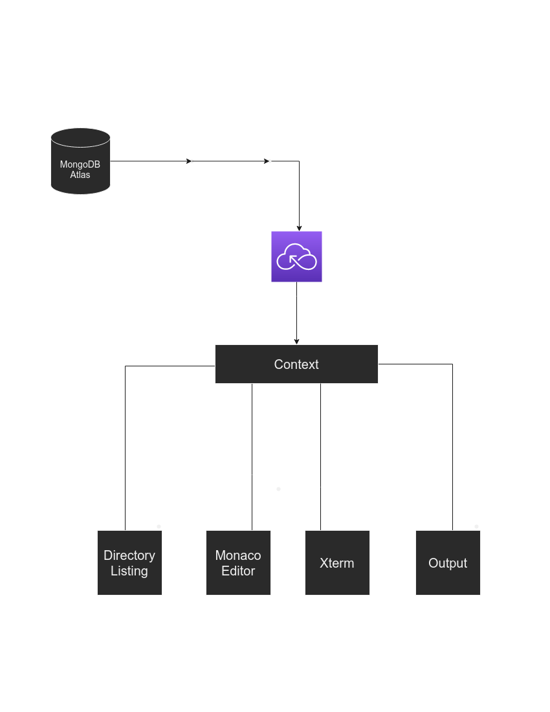

## Front-End Code Editor

### Architechture


### Installation

**`git clone https://github.com/abdulsamad/front-end_code_editor.git`**

**`yarn install`**

**`yarn global -g vercel`**

### Environment Variables
```js
DATABASE_URI = /* Your MongoDB URI */
```


### Development

[Create Vercel account](https://vercel.com/dashboard) (If not already)

Run **`vercel`** command in project directory and connect project to vercel account

Run **`vercel dev`** command to start local server

For more information go to [Vercel CLI docs](https://vercel.com/docs/cli)

### Screenshot


